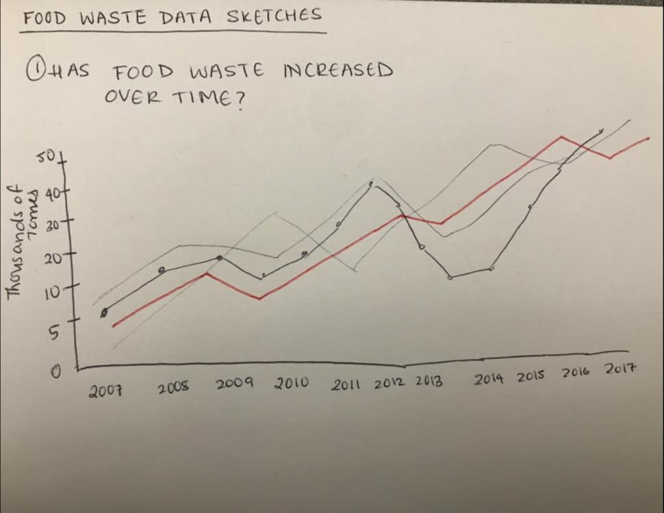
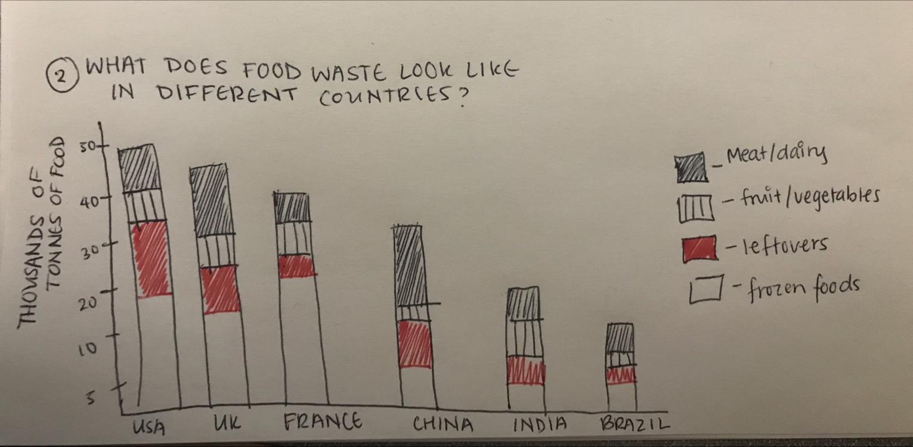
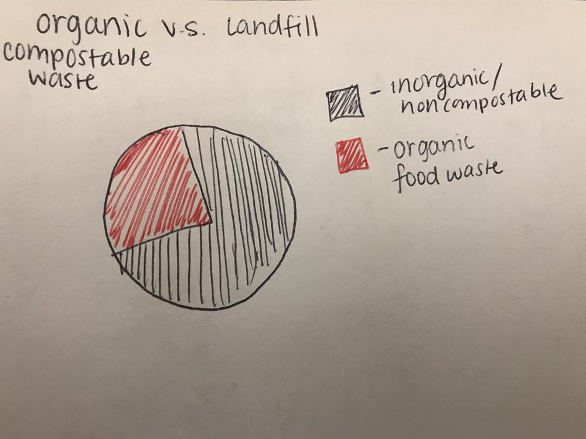
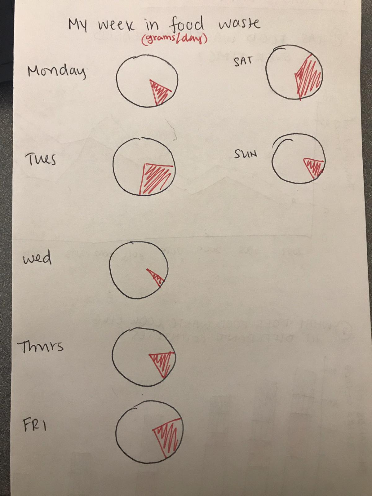
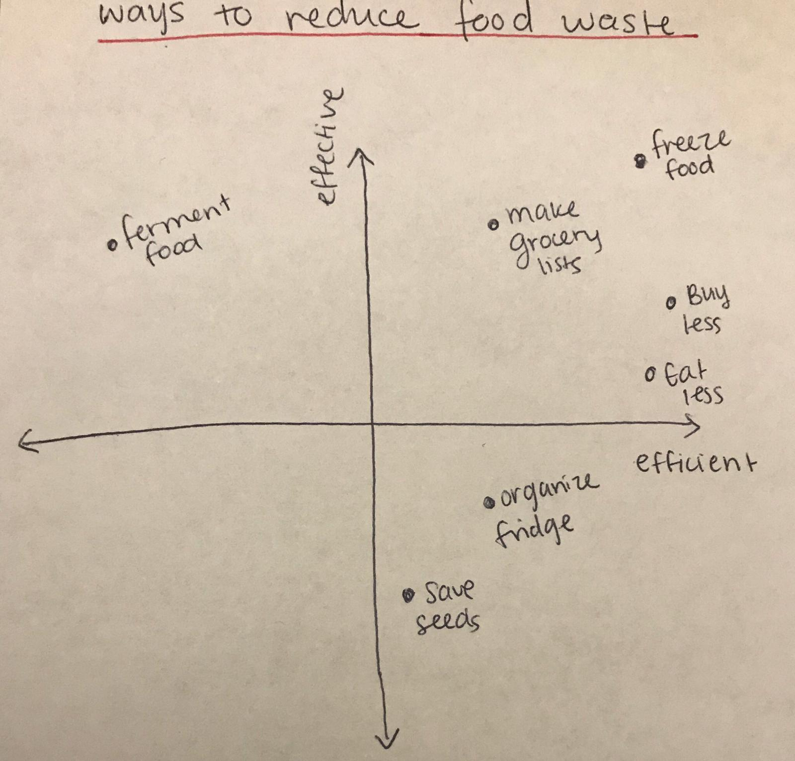

# Video Presentation with Final Project Outline

<a href="https:&#x2F;&#x2F;www.canva.com&#x2F;design&#x2F;DADzXaSlGQQ&#x2F;view?utm_content=DADzXaSlGQQ&amp;utm_campaign=designshare&amp;utm_medium=embeds&amp;utm_source=link" target="_blank" rel="noopener">Food Waste</a> by <a href="https:&#x2F;&#x2F;www.canva.com&#x2F;ChinmayeeBala?utm_campaign=designshare&amp;utm_medium=embeds&amp;utm_source=link" target="_blank" rel="noopener">Chinmayee Bala</a>

# Design Sketches 

In this sketch I aim to show the different countries and how their food waste in thousands of tons/annum has increased or decreased over time. The red line is to show that the chart will have an interactive component that will allow users to filter by country. 

This stacked bar graph shows how much of each category of food different countries are throwing away in a given year. This can help identify if there are trends based on region or if it differs based on country. 

This pie chart is essentially to show what percent of food waste can actually be used as compost and what percent goes into landfills. This graph is more for impact and serves to persuade the user to lower the amount that can't be reused. 

This is a series of "plates" that show how much food I have wasted every day of the week. Tracking amounts like this help show people that maybe by the end of the week X number of plates have been wasted. 

This chart shows the ways of reducing food waste ranked by their efficiency (measured in time spent) and their effectiveness (measured in how much food waste can actually be reduced). The data for this graph will be aggregated from several reputable sources including the World Economic Forum and the UN Food and Agricultural Organization. 

Although there are several more visualizations I could include I decided to narrow it down to these 5 to test on users. 

# Method and Medium
For this project I plan on using Tableau to create the visualizations and Shorthand to build the story. Tableau will allow for user interaction which I hope can empower me to tell a more engaging story as mentioned in the Good Charts book. Shorthand is the most user friendly for this purpose and will help deliver the aesthetic that I want to create. The imagery surrounding my final deliverable will strongly reflect the outline I included at the top of this page. This includes visualizations of fresh produce and a color palette of earthy tones such as green, brown, orange, and maroon. The site should be pleasant to look at, but also simple so that users are not overwhelmed by complex visualizations or heavy text. The idea is that the call to action should seem completely feasible for anybody who comes across the site. I believe that using pleasant, uplifiting visuals of fresh produce will help make the call to action a lot more practical and less intimidating. The final call to action will be to ask users to engage in one method of reducing food waste for the next month. Since the site will identify several methods and even rank them, this should be easy for someone to do. 

[Home Page](/README.md)
