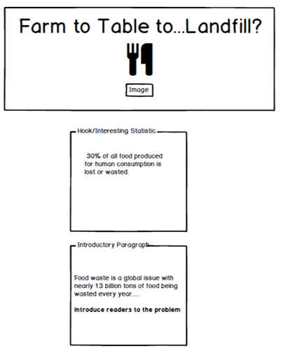
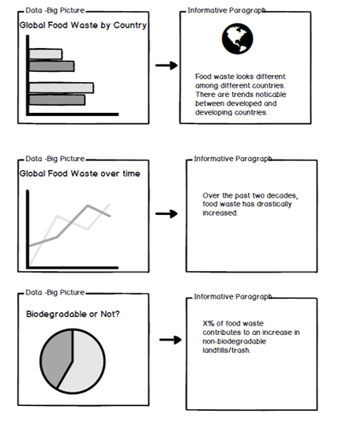
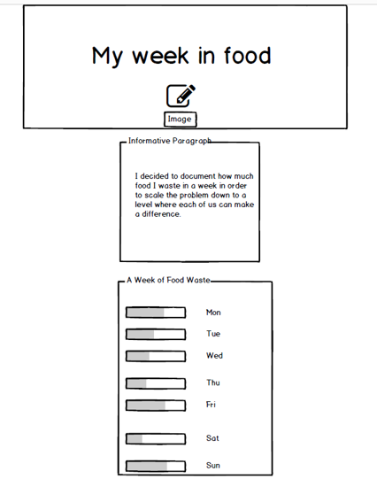
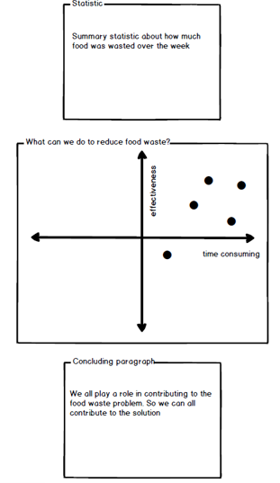
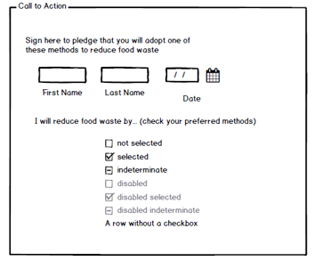
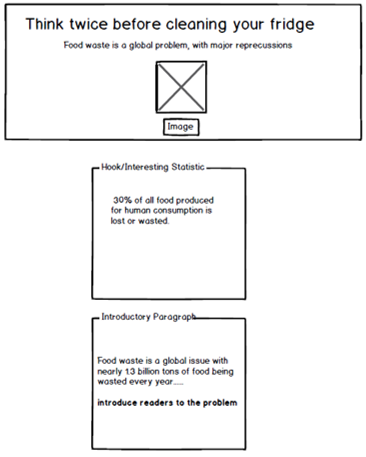
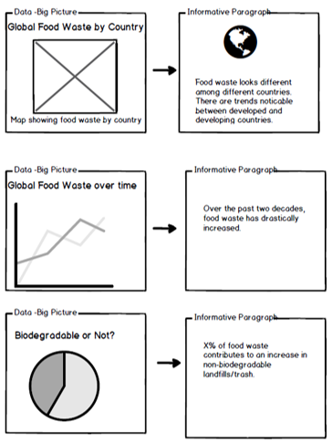
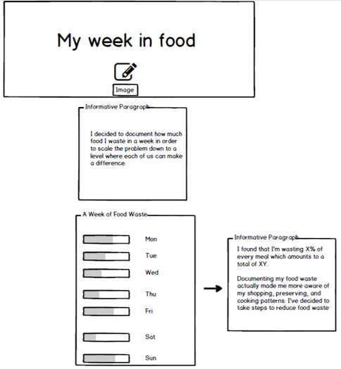
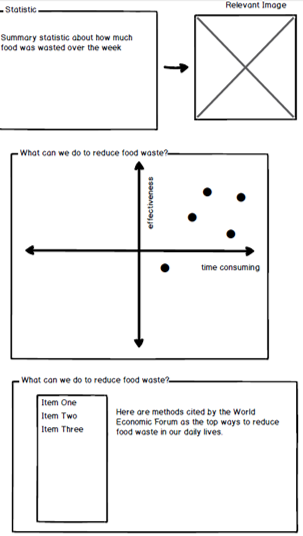
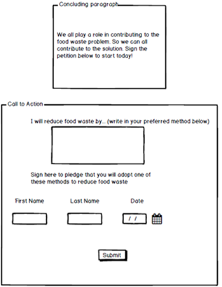

# Final Project Part 2 - Storyboards and User Research
Below is the first storyboard I used to conduct user research. It is read from top to bottom and is supposed to be a shell of the Shorthand website that I will eventually be creating. All of the visual elements that I plan on including in the final exist in this storyboard. 

# User Research Protocol
I want my site to be useful and informative to a wide range of people. That being said, a lot of recommended calls to action are directed towards people who can make decisions about shopping and preparing food. So I narrowed down my target audience to anyone 16 and over. Based on that I decided to get a wide range of people from different age groups and backgrounds. I developed my interview script in a way that the questions are not leading and remain open-ended. I wanted to gauge how much exposure people have had to this topic previously in order to determine what I should include in the website and what might seem redundant or unnecessary. I also made sure not to tell anyone that this was my work in order to get their honest opinions. In addition to the script I provided quotes/notes from each of the user interviews below. 

# Interview Script
Hello, thank you for taking the time to speak with me today, this will only take 10-15 minutes of your time. I have sent you a pdf of a wireframe for a website. I will give you some time to look it over and then ask a few questions about how you feel about the site. Please be honest and provide as much detail as you can. 

1.) Tell me in your own words what you think the purpose of this site is?

2.) How much did you know about this topic beforehand? 

3.) What is something new you learned from this site?

4.) What about this (if anything) makes you want to take action?

5.) What  about this  is confusing or off-putting?

6.) What about this would you change/add/remove and why?

# User A
Female - 45 years old, has a 2-year associates degree 

1.) Tell me in your own words what you think the purpose of this site is?

Its about Food Waste problem globally, factors contributing to it and ways to control food waste.

2.) How much did you know about this topic beforehand? 
I knew that food waste is a problem, but that's about it. 

3.) What is something new you learned from this site?
Learnt quantitatively how much food is wasted globally and how food waste contributes to increase in non-biodegradable landfills/trash.

4.) What about this (if anything) makes you want to take action?
Looking at the picture and statistics of Global food waste over time, global contribution to food waste and knowing that food waste is non-biodegradabe trash makes me take action.

5.) What  about this  is confusing or off-putting?
The graph about 'what can we do to reduce food waste?' is not very clear.

6.) What about this would you change/add/remove and why?
I would change Call to Action part of the site. Instead of check boxes for preferred methods, I would write clear description on actions I plan to take. 
Adding Global waste food by Type might also be helpful, indicating if the wastage is more raw food or cooked food might give an idea to the consumers on what to control and how to control.

# User B
Male, 26 years old, Computer Scientist

1.  Tell me in your own words what you think the purpose of this site is?
This site primarily appears to be one of just information. The site looks to give an overview and then make that information digestable for an regular person. To help them make a difference at an individual level. Seems like this site might be part of a social movement/campaign.

2. How much did you know about this topic beforehand? 
I did not know much about the topic of food waste before. I knew that a lot of food does get wasted - but the site has a lot of levels of the same information that i would not know.

3. What is something new you learned from this site?
Different ways to look at food waste. Like by country, degradable vs not, and effectiveness of strategies vs how time consuming they are. No information is specific so not direct - but just approaches to looking at food waste.

4.  What about this (if anything) makes you want to take action?
The section of someone else recording how their food waste is - if the information is relatable that would be the only part that would make me want to take action. 

5.  What  about this  is confusing or off-putting?
There's too much data and charts as opposed to stories or pictures of food waste. Seems very much a data approach to a social problem. Hard to get myself motivated to sign at the end to take action.

6. What about this would you change/add/remove and why?
I would add a section about coming together as a community or how people with similar habits have changed from x amount of food waste to current amounts. Specific actions I am pledging to do.

# User C
Female, 18, college student

1.Tell me in your own words what you think the purpose of this site is?
The purpose of this website is to illustrate the problem of food waste in the world and then provide specific examples of how an individual can reduce their own personal food waste.

2. How much did you know about this topic beforehand? 
I knew that food waste was increasing over time (especially in America).

3.  What is something new you learned from this site?
I learned that food waste isn't innately biodegradable and that it can actually increase the quantity of non-biodegradable landfills.

4. What about this (if anything) makes you want to take action?
I feel a sense of guilt over knowing I have contributed to food waste in my life and am interested to understand different methods to help curb those bad habits.

5. (and 6)  What  about this  is confusing or off-putting?
I could be wrong but my instincts are telling me that individual people can't be the biggest cause of food waste. I would be interested to see more statistics on if the food industry itself is responsible for the increase through actions like throwing away perfectly good food because it's not "attractive enough" (like vegetables that are mishapen) or refusing to donate unsold food to those in need.

# Documented Findings
I found that there is overall consensus that the information on this site is not too redundant or obvious. Although people seem to be familiar with the topic, they are unaware of specific statistics or data regarding the topic. It is interesting that none of my users identified the purpose of the site to be to persuade people to act to reduce food waste in their lives. I think that this shows that I should emphasize my call to action more obviously. Everyone also wanted specific actions to be identified, which I planned on including in the final version of the website. All three of my users were also caught offguard by the personal food waste data, but they liked that aspect of the site a lot. I think that this means I should incorporate better transitions from the global part of the story to the more personal part. One specific piece of feedback that I got was that there isn't enough context/imagery provided to make the argument very persuasive. So I will be sure to include more persuasive imagery in my final version. This would include pictures of where non-biodegradable food waste ends up, and maybe personal pictures I take as I document my week in food. 

Although I didn't include it in the quotes, two of the users suggested using a map to showcase food waste around the world. I included a basic prototype of a heat map that I could include that shows the volume of food being wasted by country. I agree with my users that this would be a better way to portray what I thought I should use a bar chart for. 

# Updated Story board

Below is a prototype of the map that I intend on including in my final. 

<a href="https://infogram.com/d6871ce6-b621-4481-9222-e264399d1a56" style="color:#989898!important;text-decoration:none!important;" target="_blank">Untitled slide project</a> <a href="https://infogram.com" style="color:#989898!important;text-decoration:none!important;" target="_blank" rel="nofollow">Infogram</a>

